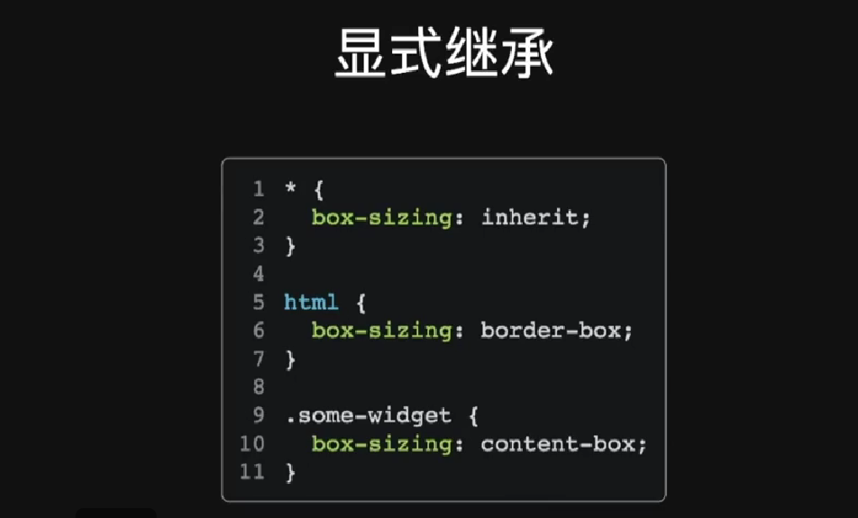
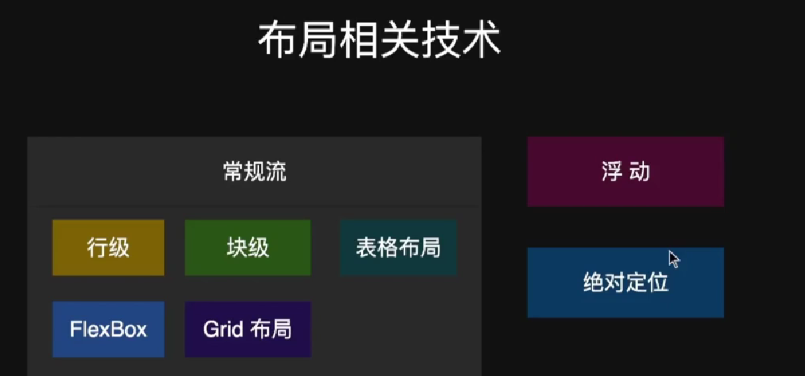

# html
##  a标签的使用 
```html
<!-- target的设置表示重新在一个端口打开链接地址 -->
<a target="_blank" href=""></a>
```
## input 的使用
```html
 <input type="text">
 :focus{
    outline:red
 }
    <input type="textarea">
    <input type="date" min="2022-01-01">    
    <input type="range">    
    <input type="number" min="1" max="5">
    <label for="">
        <input type="radio" name="sport">瑜伽
    </label>
    <label for="">
        <input type="radio" name="sport">羽毛球
    </label>

    <select name="clothes" id="">
        <!-- value可以不设置 -->
        <option value="衣服">衣服</option>
        <option value=" ">裤子</option>
        <option value="袜子">袜子</option>
        <option value="鞋子">鞋子</option>
    </select>

    <input list="cities" type="text"> 城市
    <datalist  id="cities">
        <!-- 注意这里一定要设置value才行，给输入框提示已经有的选择 -->
        <option value="Wuhan"></option>
        <option value="Yunnan">Yunnan</option>
        <option value="">Beijing</option>
    </datalist>
 

```
## 引用
```html
blocknote
cite
queo
code
```
# css
## 

## 布局相关技术

### flex布局
flex布局不熟悉的地方主要是flex的伸缩性，
`flex:1` 实际上是 `flex-grow:1; flex-shrink:1; flex-basis:0%;` 的简写，

flex 伸缩项属性一共有三个，即flex-basis，flex-grow，flex-shrink；
1. flex-grow:有剩余空间时的伸展能力,剩余空间按照flex-grow的比例分配；
2. flex-shrink:容器空间不足时收缩的能力；
3. flex-basis:没有伸展或者收缩的基础长度。
### grid布局
如果说flex布局是一维的话，grid就是二维平面的。通过网格先对区域进行划分，然后根据`grid-template-columns`属性定义每一列的列宽，`grid-template-rows`属性定义每一行的行高。
```html 
  display: grid;
  grid-template-columns: 33.33% 33.33% 33.33%;
  grid-template-rows: 33.33% 33.33% 33.33%;
```

  有时候，重复写同样的值麻烦，可以使用`repeat()`函数，简化重复的值。上面的代码用`repeat()`改写如下。
  ```html 
  display: grid;
  grid-template-columns: repeat(3, 33.33%);
  grid-template-rows: repeat(3, 33.33%);
```
  并且指定区域的时候如下即可。
```html
grid-template-areas：'a b c';
<!-- 还可以是通过横竖网格线指定区域边界 -->
 grid-area: <row-start> / <column-start> /<row-end> / <column-end>;
grid-area: 1 / 1 / 3 / 3;
```

 
