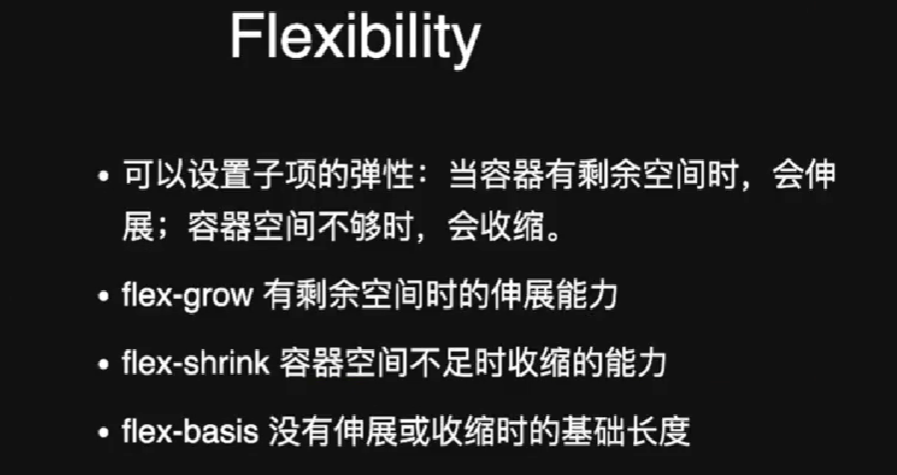
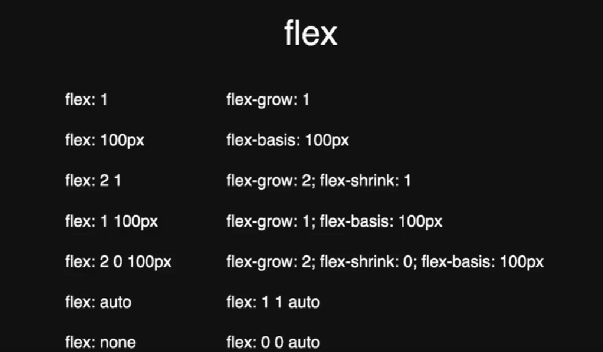

# html
##  a标签的使用 target的设置表示重新在一个端口打开链接地址
```html
<a target="_blank" href=""></a>
```
## input 的使用
```html
 <input type="text">
    <input type="textarea">
    <input type="date" min="2022-01-01">    
    <input type="range">    
    <input type="number" min="1" max="5">
    <label for="">
        <input type="radio" name="sport">瑜伽
    </label>
    <label for="">
        <input type="radio" name="sport">羽毛球
    </label>

    <select name="clothes" id="">
        <option value="衣服">衣服</option>
        <option value=" ">裤子</option>
        <option value="袜子">袜子</option>
        <option value="鞋子">鞋子</option>
    </select>

    <input list="cities" type="text"> 城市
    <datalist  id="cities">
        <!-- 注意这里一定要设置value才行，给输入框提示已经有的选择 -->
        <option value="Wuhan"></option>
        <option value="Yunnan">Yunnan</option>
        <option value="">Beijing</option>
    </datalist>
 

```
## 布局

### flex布局

剩余空间按照flex-grow的比例分配

flex:1 实际上是 flex-grow:1; flex-shrink:1; flex-basis:0%; 的简写，

flex 伸缩项属性一共有三个，即flex-basis，flex-grow，flex-shrink;

1. flex-grow:有剩余空间时的伸展能力,剩余空间按照flex-grow的比例分配;

2. flex-shrink:容器空间不足时收缩的能力;
3. flex-basis:没有伸展或者收缩的基础长度。
